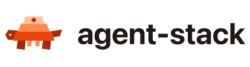
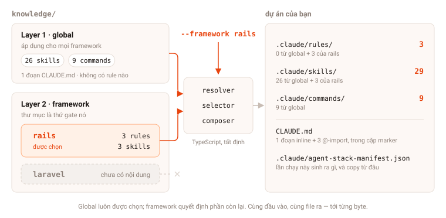

<!-- MEMO(image): logo lockup. Add ./docs/images/logo/logo-lockup.svg and logo-lockup-dark.svg (width ~400), then uncomment the block below. -->
<!--
<p align="center">
  <picture>
    <source media="(prefers-color-scheme: dark)" srcset="./docs/images/logo/logo-lockup-dark.svg">
    
  </picture>
</p>
-->

<h1 align="center">open-aidd</h1>

<p align="center">
  <strong>AI coding rules and skills for your project — selected, not generated.</strong><br>
  <strong>Open source. Deterministic. Offline.</strong><br>
  <sub>A Claude Code plugin that builds <code>CLAUDE.md</code> + <code>.claude/</code> from a curated, version-controlled knowledge base</sub><br>
  <code>/aidd-generate</code> · <code>/aidd-catalog</code>
</p>

<p align="center">
  <a href="https://github.com/TOMOSIA-VIETNAM/open-aidd/releases"></a>
  <a href="./LICENSE"></a>
  <a href="#develop"></a>
  <a href="#install"></a>
  <a href="#zero-llm-content"></a>
</p>

<!-- MEMO(i18n): if README.vi-VN.md / README.ja-JP.md are added later, uncomment this language switcher.
<p align="center">
  <a href="./README.vi-VN.md">Tiếng Việt</a> · <strong>English</strong> · <a href="./README.ja-JP.md">日本語</a>
</p>
-->

Every new repository starts the same way: someone copies a `CLAUDE.md` from the last project, deletes the parts that no longer apply, and forgets to update the rest. Within a month each project carries its own slightly-wrong dialect of the same conventions.

**`open-aidd` turns that copy-paste into a build step.** You name the tech stack; it selects the matching rules, skills and commands from a knowledge base kept in Git, resolves dependencies, stops on conflicts, and writes the result into the project.

```
Select  →  Resolve  →  Compose  →  Validate
```

<!-- MEMO(image): terminal screenshot of `/aidd-generate ruby 3.3, rails 7.1, postgres, rspec` showing the conflict prompt and the file preview. Save as ./docs/images/generate-demo.png (width ~680) and uncomment.
<p align="center">
  
</p>
-->

- **Content is never written by a model** — rules come from files a human reviewed and committed
- **The same stack always generates the same output** — resolution, version matching and composition run in TypeScript
- **Conflicts stop the run** — the generator names the conflict and the flag that waives it; it never picks a winner
- **Works offline** — the knowledge base is committed, so a generate run touches no network
- **Non-destructive** — `CLAUDE.md` is merged inside markers; only files from the previous run's manifest are ever removed

## Table of contents

- [Install](#install)
- [Quick start](#quick-start)
- [Why selection beats generation](#why-selection-beats-generation)
- [What it writes](#what-it-writes)
- [Commands](#commands)
- [CLI reference](#cli-reference)
- [Knowledge base](#knowledge-base)
- [Coverage](#coverage)
- [Develop](#develop)
- [Roadmap](#roadmap)
- [Contributing](#contributing)
- [Licence](#licence)

## Install

Requires [Node 20+](https://nodejs.org/) and [Claude Code](https://claude.ai/code).

```bash
/plugin marketplace add TOMOSIA-VIETNAM/open-aidd
/plugin install open-aidd@open-aidd
```

The repository is both the marketplace and the plugin. `dist/aidd.mjs` is committed, so the plugin runs on any machine with Node 20+ — no `npm install`, no build step.

<details>
<summary>Install from a local clone</summary>

```bash
git clone https://github.com/TOMOSIA-VIETNAM/open-aidd.git
```

```bash
/plugin marketplace add /path/to/open-aidd
/plugin install open-aidd@open-aidd
```

</details>

## Quick start

In the project you want configured:

```
/aidd-generate ruby 3.3, rails 7.1, postgres, sidekiq, rspec
```

The command maps your request to catalog ids, resolves dependencies, stops on any conflict to ask you, previews the file list, and only then writes.

To see what the knowledge base covers before you commit to a stack:

```
/aidd-catalog
```

## Why selection beats generation

Most "generate my AI rules" tools ask a model to write the rules. The output reads well and drifts every run — different wording, different strictness, conventions the team never agreed to.

| Model-written rules | `open-aidd` |
| --- | --- |
| Each run produces different text for the same stack | Same stack in, same files out — byte for byte |
| Rules sound right but were never reviewed by anyone | Every line is a committed file with an author and a diff |
| Two incompatible choices get quietly reconciled | The run **stops**, names the conflict, prints the waiver flag |
| Improving a rule means re-prompting, per project | Improve the file once; every project picks it up on re-run |
| Needs a network call and a token budget to scaffold | Generating is offline and free |

### Zero-LLM content

<a name="zero-llm-content"></a>

The model in the loop has exactly two jobs: turn a sentence into CLI flags, and relay a conflict to you. It decides nothing else and writes no rule content. Everything downstream — dependency expansion, version-range matching, selection, composition, validation — is TypeScript under `src/`, covered by tests that load the real knowledge base.

## What it writes

```
CLAUDE.md                        global guidance and @-imports, inside aidd markers
.claude/rules/NN-<id>.md         one file per selected rule, priority-ordered
.claude/skills/<id>/SKILL.md     one directory per selected skill, with its files
.claude/commands/<id>.md         one file per selected command
.claude/aidd-manifest.json       what this run generated, and where it was copied from
```

`CLAUDE.md` holds the global guidance inline, then `@`-imports the stack-specific rules. It is **merged, never replaced**: text outside the `aidd:begin` / `aidd:end` markers is left alone.

On a re-run, files listed in the previous manifest that are no longer selected are removed — and nothing else is ever deleted. Anything outside the manifest belongs to you.

## Commands

| Command | What it does |
| --- | --- |
| `/aidd-generate <stack>` | Resolves the stack, previews the file list, then writes `CLAUDE.md` and `.claude/`. Stops on any conflict and asks |
| `/aidd-catalog` | Lists the technologies, rules, skills and commands the knowledge base covers — and the gaps |

## CLI reference

The plugin is a thin wrapper over a CLI you can run directly, in CI or by hand:

```bash
node dist/aidd.mjs catalog  [--json]
node dist/aidd.mjs resolve  --language ruby@3.3 --framework rails@7.1 [--json]
node dist/aidd.mjs generate --language ruby@3.3 --framework rails@7.1 --out . [--write]
```

**Stack slots** — each repeatable, each taking `tech` or `tech@version`:

`--language` · `--framework` · `--frontend` · `--database` · `--cache` · `--testing` · `--infrastructure` · `--architecture` · `--library`

**Exit codes:**

| Code | Meaning |
| --- | --- |
| `0` | Success |
| `2` | Validation errors |
| `64` | Bad usage |
| `65` | Unknown technology |

`--json` output is a stable contract — `commands/aidd-generate.md` parses it, and so can your CI.

## Knowledge base

`knowledge/` is the product. See [knowledge/README.md](knowledge/README.md) for the metadata schema and how to add a rule, a skill or a technology.

```
knowledge/
├── catalog.yaml            technology graph: requires / conflicts_with / versions
├── upstream.yaml           where imported content came from, pinned to a commit
├── rules/<layer>/<id>.md
├── skills/<layer>/<id>/SKILL.md
├── commands/<id>.md
└── claude-md/<id>.md       inlined into the project's CLAUDE.md, not emitted as a file
```

The directory decides the layer (`global`, `language`, `framework`); the file or directory name decides the id.

Four kinds of content, and the distinction matters:

| Kind | It is | When it loads |
| --- | --- | --- |
| **Rule** | A convention — *how code must be written* | Always in context, via `@`-import |
| **Skill** | A procedure — *how to carry out task X*, in steps | When that task comes up |
| **Command** | Something the developer types | On demand |
| **CLAUDE.md fragment** | Guidance every project needs inline | From the first token |

<!-- MEMO(image): a layer diagram — Layer 1 global / Layer 2 language / Layer 3 framework, with the resolver pulling a slice down each column. Save as ./docs/images/layers.svg (+ layers-dark.svg) and uncomment.
<p align="center">
  <picture>
    <source media="(prefers-color-scheme: dark)" srcset="./docs/images/layers-dark.svg">
    
  </picture>
</p>
-->

## Coverage

**Layer 1 — global.** Copied from two MIT projects at the commits pinned in `upstream.yaml`: 25 skills and 9 commands from [addyosmani/agent-skills](https://github.com/addyosmani/agent-skills), and the behavioural guidelines from [multica-ai/andrej-karpathy-skills](https://github.com/multica-ai/andrej-karpathy-skills), inlined directly into every project's `CLAUDE.md`. They are committed here, so generating needs no network. `npm run sync` re-copies them at the pinned commit — see [knowledge/README.md](knowledge/README.md#imported-content).

**Layers 2 and 3 — authored here.** Ruby, Rails, Active Record, RSpec.

**The technology graph** covers 21 technologies across nine slots — Ruby, PHP, Node, Rails, Laravel, NestJS, Active Record, Sidekiq, Stimulus, React, PostgreSQL, MySQL, Redis, RSpec, Minitest, Docker, AWS, ECS, RDS, monolith, microservices. Each resolves and conflict-checks correctly; the ones without content yet are reported by the validator as `uncovered-technology` rather than failing the run.

> [!NOTE]
> A technology in the catalog with no rules attached is a documented gap, not a bug. Adding content for it is the highest-value contribution — see [CONTRIBUTING.md](CONTRIBUTING.md).

## Develop

```bash
npm install
npm run check      # typecheck + tests + bundle — before every push
npm run sync       # re-copy imported content at the pinned commit
npm run try        # generate into .aidd-try/ to read the output for real
```

`npm run try` runs the plugin against a scratch project inside this repository, so you can read the generated tree instead of guessing at it. It takes the same stack flags as the CLI, and `--clean` removes the directory:

```bash
npm run try -- --language node@22
npm run try -- --clean
```

`.aidd-try/` is gitignored.

> [!IMPORTANT]
> `dist/aidd.mjs` is committed so the plugin runs without an install step. **Rebuild and commit it with any change under `src/`** — `npm run check` does the rebuild.

### Pipeline

One concern per module:

| Module | Owns |
| --- | --- |
| `catalog.ts` | Loading the knowledge base, deriving metadata, lint |
| `upstream.ts` | What was copied from where, and under which licence |
| `resolver.ts` | Expanding the technology graph over `requires`, reporting conflicts |
| `selector.ts` | Which artifacts apply to a resolved stack |
| `version.ts` | Version-range matching |
| `composer.ts` | Building the output in memory, merging the `CLAUDE.md` block |
| `validator.ts` | Completeness and consistency findings |
| `emit.ts` | The only module that writes or deletes |
| `cli.ts` | Flags, human and `--json` output |

## Roadmap

This is phase 1 of [idea.md](idea.md) — the whole pipeline, deterministic.

- **Phase 2** — natural-language stack input: describe the project in a sentence, the model converts it to a normalized stack, resolution and composition stay deterministic.
- **Phase 3** — full project bootstrap: rules, skills and OpenSpec together, emitted for more than one AI tool.

The CLI is already the seam both phases plug into.

## Contributing

See [CONTRIBUTING.md](CONTRIBUTING.md), the [Code of Conduct](CODE_OF_CONDUCT.md), and [SECURITY.md](SECURITY.md) for reporting a vulnerability privately.

New behaviour needs a test; a bug fix needs a test that fails before it. `tests/pipeline.test.ts` loads the real knowledge base, so a content change that breaks an invariant fails the suite.

## Licence

[Apache-2.0](LICENSE) · Copyright 2026 TOMOSIA VIETNAM.

Content under `knowledge/` copied from other projects keeps its own licence; see [NOTICE](NOTICE). Generated projects record the attribution in `.claude/aidd-manifest.json`.

---

<!-- MEMO(image): small square mark for the footer. Add ./docs/images/logo/logo.svg (+ logo-dark.svg), width 44, then uncomment.
<p align="center">
  <picture>
    <source media="(prefers-color-scheme: dark)" srcset="./docs/images/logo/logo-dark.svg">
    
  </picture>
</p>
-->

<p align="center">
  <sub>Built by <a href="https://github.com/TOMOSIA-VIETNAM">TOMOSIA VIETNAM</a> · See also <a href="https://github.com/TOMOSIA-VIETNAM/open-pr">open-pr</a>, AI code review that lands on your PR</sub>
</p>
