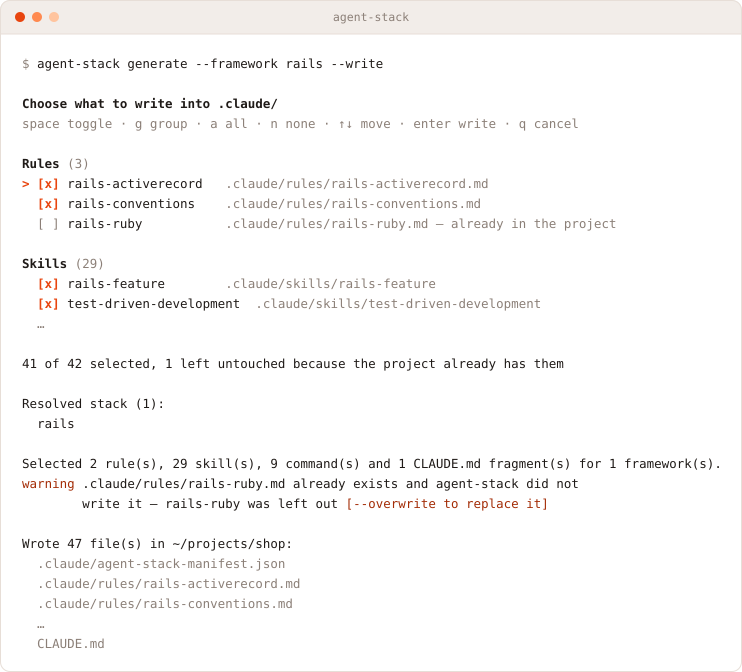

<p align="center">
  <picture>
    <source media="(prefers-color-scheme: dark)" srcset="./docs/images/logo/logo-lockup-dark.svg">
    
  </picture>
</p>

<p align="center">
  <strong>Rule và skill AI cho dự án của bạn — được <em>chọn</em>, không phải được sinh ra.</strong><br>
  <strong>Mã nguồn mở. Tất định. Chạy offline.</strong><br>
  <sub>Plugin Claude Code dựng <code>CLAUDE.md</code> + <code>.claude/</code> từ một knowledge base có kiểm duyệt, quản lý bằng Git</sub><br>
  <code>/generate</code> · <code>/catalog</code>
</p>

<p align="center">
  <a href="https://www.npmjs.com/package/@tomosia/agent-stack"></a>
  <a href="https://www.npmjs.com/package/@tomosia/agent-stack"></a>
  <a href="https://github.com/TOMOSIA-VIETNAM/agent-stack/releases"></a>
  <a href="./LICENSE"></a>
  <a href="#phát-triển"></a>
  <a href="#cài-đặt"></a>
  <a href="#không-có-nội-dung-do-llm-viết"></a>
</p>

<!-- MEMO(i18n): if README.en.md / README.ja-JP.md are added later, uncomment this language switcher.
<p align="center">
  <strong>Tiếng Việt</strong> · <a href="./README.en.md">English</a> · <a href="./README.ja-JP.md">日本語</a>
</p>
-->

Repository mới nào cũng bắt đầu giống nhau: ai đó copy `CLAUDE.md` từ dự án trước, xoá phần không còn đúng, rồi quên cập nhật phần còn lại. Sau một tháng, mỗi dự án mang một phương ngữ hơi sai lệch của cùng một bộ quy ước.

**`agent-stack` biến việc copy-paste đó thành một build step.** Bạn nêu framework dự án đang dùng; nó chọn đúng rule, skill và command từ knowledge base nằm trong Git, phân giải dependency, dừng lại khi có xung đột, rồi ghi kết quả vào dự án.

```
Chọn  →  Phân giải  →  Kết hợp  →  Kiểm tra
```

<p align="center">
  <picture>
    <source media="(prefers-color-scheme: dark)" srcset="./docs/images/generate-demo-dark.svg">
    
  </picture>
</p>

- **Nội dung không bao giờ do model viết** — rule đến từ file do con người review và commit
- **Cùng một framework luôn cho cùng một kết quả** — việc chọn là code, không phải prompt
- **Xung đột làm dừng cả lần chạy** — generator nêu tên xung đột và cờ để bỏ qua; nó không tự chọn bên thắng
- **Bạn duyệt trước khi ghi** — checklist liệt kê từng rule, skill và command; tick cái nào ghi cái đó
- **Chạy offline** — knowledge base đã được commit, nên lúc generate không đụng network
- **Không phá gì** — `CLAUDE.md` merge trong cặp marker, file dự án tự viết hay đã sửa tay đều giữ nguyên, và chỉ file nằm trong manifest của lần chạy trước — chưa bị sửa — mới bị xoá

## Cài đặt

Cần [Node 20+](https://nodejs.org/). Hai đường, dùng chung một generator.

### Dòng lệnh

```bash
npm install -g @tomosia/agent-stack
```

Bản phát hành đầu tiên là **1.0.0** — cờ CLI, hợp đồng `--json` và bố cục `knowledge/` từ đây trở đi theo [SemVer](https://semver.org/lang/vi/): thay đổi phá vỡ chúng phải lên major. Cần ghim cho CI thì `npm install -g @tomosia/agent-stack@1.0.0`; lịch sử từng bản nằm ở [Releases](https://github.com/TOMOSIA-VIETNAM/agent-stack/releases).

```bash
cd /đường/dẫn/tới/dự-án
agent-stack generate --framework rails --write
```

Không cần Claude Code, không cần API key, không gọi network: knowledge base nằm trong package. Chạy một lần thì `npx @tomosia/agent-stack generate --framework rails --write` cũng vậy.

```bash
agent-stack catalog                     # knowledge base đang có gì
agent-stack generate --framework rails  # xem trước, không ghi
agent-stack generate --framework rails --framework laravel --write
agent-stack --help
```

Không có `--write` thì không file nào bị ghi. Ở terminal tương tác, lần ghi nào cũng qua checklist duyệt trước — `--yes` bỏ qua checklist, `--json` cho máy đọc.

### Plugin Claude Code

```bash
/plugin marketplace add TOMOSIA-VIETNAM/agent-stack
/plugin install agent-stack@agent-stack
```

Repository này vừa là marketplace vừa là plugin. `dist/agent-stack.mjs` đã được commit, nên plugin chạy được trên bất kỳ máy nào có Node 20+ — không cần `npm install`, không cần build. Plugin thêm `/generate` và `/catalog`, nơi một câu tiếng người được ánh xạ sang cờ CLI ở trên.

<details>
<summary>Cài từ bản clone local</summary>

```bash
git clone https://github.com/TOMOSIA-VIETNAM/agent-stack.git
```

```bash
/plugin marketplace add /path/to/agent-stack
/plugin install agent-stack@agent-stack
```

</details>

## Bắt đầu nhanh

Trong dự án bạn muốn cấu hình:

```
/generate rails
```

hoặc, không qua Claude Code:

```bash
agent-stack generate --framework rails --write
```

Command ánh xạ yêu cầu sang id trong catalog, phân giải dependency, dừng lại hỏi khi có xung đột, xem trước danh sách file, rồi mới ghi.

Gõ thoải mái — `rails 7.1` hay `Ruby on Rails` đều được, command quy về id `rails` và bỏ qua version. Nhưng **đầu vào chỉ có framework**: nêu thêm `postgres` hay `rspec` thì command hỏi lại bạn dùng framework nào, vì catalog không có entry cho chúng. `/catalog` cho biết knowledge base đang có gì trước khi bạn chốt stack.

## Vì sao chọn lại hơn sinh

Phần lớn công cụ "sinh rule AI cho tôi" đều nhờ một model viết rule. Kết quả đọc thì xuôi nhưng mỗi lần chạy lại lệch đi — khác câu chữ, khác mức độ nghiêm ngặt, và kèm những quy ước cả team chưa từng thống nhất.

| Rule do model viết | `agent-stack` |
| --- | --- |
| Cùng một stack, mỗi lần chạy ra văn bản khác nhau | Cùng framework vào, cùng file ra — giống tới từng byte |
| Rule nghe hợp lý nhưng chưa ai review | Mỗi dòng là một file đã commit, có tác giả và có diff |
| Hai lựa chọn xung khắc bị âm thầm hoà giải | Lần chạy **dừng lại**, nêu tên xung đột, in ra cờ bỏ qua |
| Muốn cải thiện một rule phải prompt lại, từng dự án một | Sửa file một lần; mọi dự án nhận được khi chạy lại |
| Cần gọi network và tốn token để scaffold | Generate là offline và miễn phí |

### Không có nội dung do LLM viết

<a name="không-có-nội-dung-do-llm-viết"></a>

Model trong vòng lặp chỉ có đúng hai việc: biến một câu tiếng người thành cờ CLI, và chuyển tiếp xung đột cho bạn. Ngoài ra nó không quyết định gì và không viết một dòng nội dung rule nào. Toàn bộ phần sau — mở rộng dependency, chọn artifact, kết hợp, kiểm tra — là TypeScript trong `src/`, có test nạp knowledge base thật.

## Nó ghi ra những gì

```
CLAUDE.md                              hướng dẫn chung và các @-import, trong cặp marker agent-stack
.claude/rules/<tên>.md                 mỗi rule được chọn một file, copy nguyên văn
.claude/skills/<tên>/SKILL.md          mỗi skill được chọn một thư mục, kèm file của nó
.claude/commands/<tên>.md              mỗi command được chọn một file
.claude/agent-stack-manifest.json      lần chạy này sinh ra gì, và copy từ đâu
```

`CLAUDE.md` được **merge chứ không bị thay thế**: chữ nằm ngoài cặp marker `agent-stack:begin` / `agent-stack:end` được giữ nguyên. Khi chạy lại, file nào có trong manifest lần trước mà lần này không còn được chọn sẽ bị xoá — và ngoài ra không xoá gì khác. Mọi thứ ngoài manifest là của bạn.

Manifest ghi sha256 của từng file đã copy. **File agent-stack đã ghi mà bạn sửa tay thì thành của bạn**: lần chạy sau không đè (cảnh báo `modified-file`), không xoá kể cả khi nó không còn được chọn (cảnh báo `retained-file`), và rời khỏi manifest. Chỉ `--overwrite`, hoặc tick trong checklist, mới lấy lại. Thêm một file vào thư mục skill đã sinh cũng tính là sửa. Xoá một file thì không — không mất gì của bạn, nên lần sau nó được ghi lại. Manifest của bản 1.0.0 chưa có checksum, nên lần chạy đầu tiên sau khi nâng cấp chưa phân biệt được và xử lý như trước.

### Duyệt trước khi ghi

`generate --write` trong terminal hiện một **checklist** liệt kê đúng những gì nó định ghi, kèm đường dẫn đích. Không file nào rời knowledge base trước khi bạn duyệt:

```
Rules (3)
> [x] rails-activerecord   .claude/rules/rails-activerecord.md
  [x] rails-conventions    .claude/rules/rails-conventions.md
  [ ] rails-ruby           .claude/rules/rails-ruby.md — already in the project

Skills (29)
  [x] api-and-interface-design  .claude/skills/api-and-interface-design
  …

40 of 42 selected, 1 left untouched because the project already has them
```

`space` một dòng · `g` cả nhóm · `a`/`n` tất cả/không cái nào · `enter` ghi · `q` huỷ, không ghi gì.

**File dự án đã có, hoặc đã sửa từ lần chạy trước, thì mặc định không được tick** (`edited since the last run`). Một file agent-stack chưa từng ghi — không nằm trong manifest lần trước — là của bạn: không bị đè, không vào manifest, không được `@`-import vào `CLAUDE.md`. Tick nó, hoặc chạy `--overwrite`, thì agent-stack mới nhận lấy.

Không có terminal — `--json`, CI, hay gọi qua slash command — thì checklist không hiện, nhưng mặc định vẫn y nguyên, và mỗi đường dẫn bị bỏ qua đều in ra kèm cờ để bỏ qua nó.

## Command và agent

| Gọi bằng | Làm gì | Ai xác định framework |
| --- | --- | --- |
| `/generate <stack>` | Phân giải stack, xem trước, rồi ghi `CLAUDE.md` và `.claude/`. Xung đột thì dừng và hỏi; file dự án đã có thì giữ nguyên | Bạn gõ |
| `/catalog` | Liệt kê technology, rule, skill và command knowledge base đang phủ — và cả chỗ còn trống | — |
| agent `detect` | Đọc repo để tự suy ra stack, đưa bảng cho bạn duyệt, rồi chạy tiếp đúng luồng `/generate` | Agent suy ra, bạn duyệt |

`detect` đọc `Gemfile.lock`, `composer.lock`, `composer.json`, và cấu trúc thư mục khi không có lockfile nào được commit. Nó chỉ đi tìm **một thứ**: framework — ngôn ngữ, database, cache và hạ tầng không phải đầu vào, đọc thêm về chúng chỉ là nhiễu. Kết quả gắn nhãn `found` (có tên trong manifest hoặc lockfile), `uncertain` (chỉ suy từ cấu trúc thư mục) hay `missing`; không phải `found` thì phải hỏi lại bạn trước khi generate. Nó chạy trong subagent để việc đọc cả chục file manifest không đổ vào context chính.

## Tham chiếu CLI

Plugin chỉ là lớp mỏng bọc một CLI mà bạn chạy trực tiếp được, trong CI hoặc bằng tay:

```bash
node dist/agent-stack.mjs catalog  [--json]
node dist/agent-stack.mjs resolve  --framework rails [--json]
node dist/agent-stack.mjs generate --framework rails --framework laravel --out . [--write]
```

**Đầu vào chỉ có một cờ** — `--framework <id>`, lặp lại được cho dự án nhiều framework. Không có cờ cho ngôn ngữ, database, cache hay hạ tầng, và cũng không có entry nào cho chúng trong catalog. Không có cú pháp `@version`. Framework là thứ operator luôn biết chắc; mỗi cờ thêm vào là thêm một cơ hội để operator bỏ sót và rule biến mất mà không báo gì.

| Cờ | Ý nghĩa |
| --- | --- |
| `--out <dir>` | Thư mục dự án đích (mặc định: thư mục hiện tại) |
| `--write` | Ghi file thật; không có cờ này thì chỉ xem trước |
| `--yes` | Bỏ qua checklist duyệt, lấy luôn mặc định |
| `--overwrite` | Đè cả những file dự án đã có hoặc đã sửa, thay vì để yên chúng |
| `--accept-conflict <id>` | Chấp nhận đúng một xung đột, theo id mà CLI in ra |
| `--knowledge <dir>` | Dùng knowledge base ở chỗ khác (mặc định: bản đi kèm) |
| `--json` | Xuất dạng máy đọc — hợp đồng ổn định, `commands/generate.md` parse nó |

Exit code: `0` thành công · `2` lỗi ở bước kiểm tra · `64` sai cách dùng · `65` technology không tồn tại · `130` bạn huỷ ở checklist.

## Knowledge base

`knowledge/` chính là sản phẩm. **Đường dẫn là metadata, và file không bao giờ bị đụng tới**: agent-stack không đọc, không sửa, không dựng lại front matter — file sinh ra giống file trong `knowledge/` từng byte. Ngoại lệ duy nhất là `claude-md/`, được inline vào `CLAUDE.md` chứ không copy.

```
knowledge/
├── catalog.yaml            đồ thị framework: requires / conflicts_with
├── upstream.yaml           nội dung import lấy từ đâu, ghim theo commit
├── rules/global/<tên>.md                 ra .claude/rules/<tên>.md
├── rules/framework/<fw>/<tên>.md         ra .claude/rules/<fw>-<tên>.md
├── skills/framework/<fw>/<tên>/SKILL.md  ra .claude/skills/<tên>/
├── commands/<tên>.md                     ra .claude/commands/<tên>.md
└── claude-md/<tên>.md                    inline vào CLAUDE.md, không sinh file riêng
```

Bốn loại nội dung, và phân biệt được chúng là quan trọng:

| Loại | Nó là gì | Nạp khi nào |
| --- | --- | --- |
| **Rule** | Một quy ước — *code phải viết thế nào* | Luôn ở trong context, qua `@`-import |
| **Skill** | Một quy trình — *làm việc X theo các bước nào* | Khi gặp đúng việc đó |
| **Command** | Thứ developer gõ ra | Khi được gọi |
| **Đoạn CLAUDE.md** | Hướng dẫn mọi dự án đều cần sẵn inline | Ngay từ token đầu tiên |

Nếu bạn đang viết các bước được đánh số thì đó là **skill**, không phải rule.

[knowledge/README.md](knowledge/README.md) là tham chiếu đầy đủ: đường dẫn quyết định những gì, front matter nào Claude cần, thứ tự `@`-import, và cách xử lý khi chọn nhiều framework cùng lúc.

<p align="center">
  <picture>
    <source media="(prefers-color-scheme: dark)" srcset="./docs/images/layers-dark.svg">
    
  </picture>
</p>

## Phạm vi hiện có

**Layer 1 — global.** Copy từ hai dự án MIT tại commit được ghim trong `upstream.yaml`: 26 skill và 9 command từ [addyosmani/agent-skills](https://github.com/addyosmani/agent-skills), và bộ hướng dẫn hành vi từ [multica-ai/andrej-karpathy-skills](https://github.com/multica-ai/andrej-karpathy-skills), inline thẳng vào `CLAUDE.md` của mọi dự án.

**Layer 2 — tự viết trong repo này.** Ruby, Rails, Active Record, tất cả gate bằng `rails`.

**Catalog đúng hai entry: Rails và Laravel.** Laravel hiện chưa có nội dung nào, và validator báo nó là `uncovered-technology` chứ không làm hỏng lần chạy.

> [!NOTE]
> Một framework có trong catalog mà chưa có rule nào là **khoảng trống đã được ghi nhận, không phải bug**. Bổ sung nội dung cho nó là đóng góp có giá trị nhất.

## Đóng góp

[CONTRIBUTING.md](CONTRIBUTING.md) là quy trình từng bước; [knowledge/README.md](knowledge/README.md) là tham chiếu đường dẫn; `npm run new-framework -- <id> "<Name>"` dựng sẵn khung cho một framework mới. Ba chỗ dễ sai nhất:

> [!WARNING]
> **Mọi artifact gate bằng framework, và thư mục là thứ gate nó.** Catalog không có `php`, `eloquent`, `pest` hay `postgresql`, nên rule Eloquent nằm dưới `framework/laravel/`, rule style PHP cũng vậy. Một thư mục dưới `framework/` không phải id trong catalog bị lint chặn ngay. Lỗi "rule biến mất im lặng" này từng xảy ra thật với Active Record, và một lần nữa với RSpec.

> [!IMPORTANT]
> **Không khai metadata của agent-stack trong file — không có trường nào để khai.** Thứ gì bạn viết trong front matter sẽ được copy nguyên vào mọi dự án sinh ra, nên chỉ để lại thứ Claude cần đọc: `name` + `description` trong `SKILL.md`, `description` trong command, và không gì cả trong rule.

> [!IMPORTANT]
> **Việc chọn không nhìn tới version.** Không có trường `versions`, và `--framework laravel@11` không phải cú pháp hợp lệ. Nội dung nào chỉ đúng từ một version nào đó thì viết điều kiện ngay trong thân rule.

Checklist trước khi push:

- [ ] `npm run check` xanh (typecheck + test + bundle)
- [ ] Đã commit `dist/agent-stack.mjs` nếu có sửa gì trong `src/`
- [ ] Có test mới cho hành vi mới, hoặc test fail-trước-khi-sửa cho bug fix
- [ ] Đã đọc output của `npm run try` bằng mắt, không chỉ tin test
- [ ] Không sửa file nào nằm dưới đường dẫn mà `upstream.yaml` ánh xạ tới — lần sync sau ghi đè
- [ ] Commit theo Conventional Commits, tiêu đề ở thể mệnh lệnh, dưới 72 ký tự; body giải thích **vì sao**

## Phát triển

```bash
npm install
npm run check      # typecheck + test + bundle — chạy trước mỗi lần push
npm run sync       # copy lại nội dung import tại commit đã ghim
npm run try        # generate vào .agent-stack-try/ để đọc kết quả thật
```

> [!IMPORTANT]
> `dist/agent-stack.mjs` được commit để plugin chạy mà không cần cài đặt gì. **Rebuild và commit nó cùng mọi thay đổi trong `src/`** — `npm run check` lo phần rebuild.

### Pipeline

Mỗi module một mối quan tâm. Sửa gì thì đặt vào đúng chỗ mối quan tâm đó đang sống:

| Module | Sở hữu |
| --- | --- |
| `catalog.ts` | Nạp knowledge base, suy ra metadata, lint |
| `upstream.ts` | Cái gì copy từ đâu, theo giấy phép nào |
| `resolver.ts` | Mở rộng đồ thị technology qua `requires`, báo cáo xung đột |
| `selector.ts` | Artifact nào áp dụng cho một stack đã phân giải |
| `composer.ts` | Dựng output trong bộ nhớ, merge block `CLAUDE.md` |
| `validator.ts` | Các phát hiện về tính đầy đủ và nhất quán |
| `prompt.ts` | Checklist duyệt trên terminal, và không gì khác |
| `emit.ts` | Module **duy nhất** được ghi hoặc xoá |
| `cli.ts` | Cờ dòng lệnh, output cho người và `--json` |

> [!CAUTION]
> `emit.ts` chỉ được xoá những đường dẫn có trong manifest của lần chạy trước. Không bao giờ nới rộng phạm vi đó. Mọi thứ ngoài manifest thuộc về người dùng.

### Hai invariant

Mọi thứ ở đây xoay quanh hai điều này. Thay đổi nào làm yếu một trong hai phải nói thẳng ra, không được lách qua:

1. **Việc chọn là tất định.** Model chỉ làm [đúng hai việc đã nêu ở trên](#không-có-nội-dung-do-llm-viết); phần còn lại là TypeScript trong `src/`. Checklist duyệt chỉ **thu hẹp** kết quả đó — bỏ bớt artifact, không bao giờ thêm vào, và không đổi nội dung file nào.
2. **Xung đột không bao giờ được hoà giải âm thầm.** Khi hai technology được chọn bị khai là không tương thích, lần chạy dừng lại, nêu tên xung đột, và in ra cờ để bỏ qua.

Điều thứ ba đúng với knowledge base: **generate là offline.** Một lần generate chỉ đọc repository này và ghi vào thư mục đích. Chỉ `npm run sync`, chạy có chủ đích, mới đụng network.

## Giấy phép

[Apache-2.0](LICENSE) · Copyright 2026 TOMOSIA VIETNAM. Nội dung trong `knowledge/` copy từ dự án khác giữ giấy phép riêng của nó; xem [NOTICE](NOTICE). Dự án được generate ghi lại phần ghi công trong `.claude/agent-stack-manifest.json`.

[CONTRIBUTING.md](CONTRIBUTING.md) · [Code of Conduct](CODE_OF_CONDUCT.md) · [SECURITY.md](SECURITY.md) để báo lỗ hổng bảo mật riêng tư, không qua issue công khai.

---

<p align="center">
  <picture>
    <source media="(prefers-color-scheme: dark)" srcset="./docs/images/logo/logo-dark.svg">
    
  </picture>
</p>

<p align="center">
  <sub>Thực hiện bởi <a href="https://github.com/TOMOSIA-VIETNAM">TOMOSIA VIETNAM</a> · Xem thêm <a href="https://github.com/TOMOSIA-VIETNAM/open-pr">open-pr</a>, AI code review chạy thẳng trên PR của bạn</sub>
</p>
